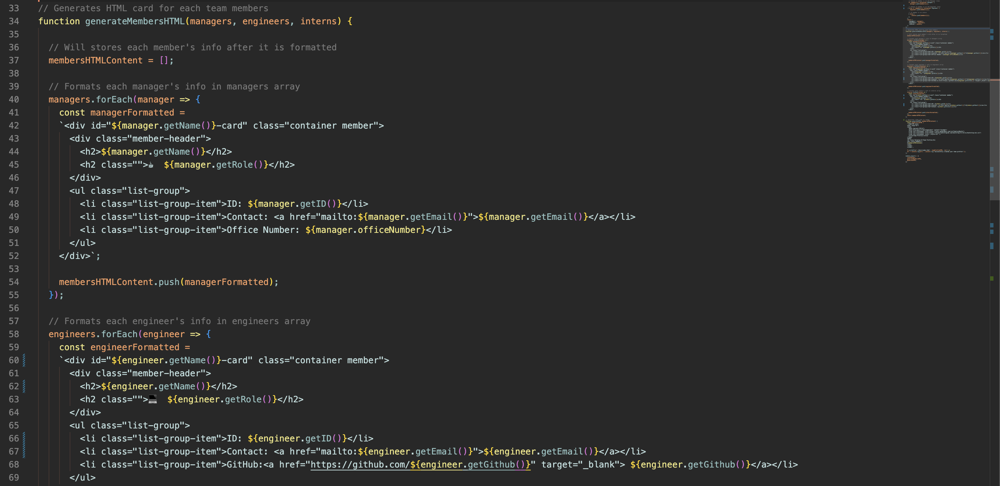
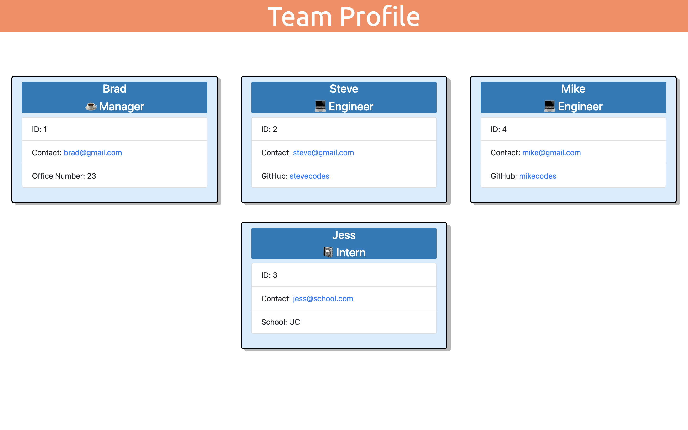
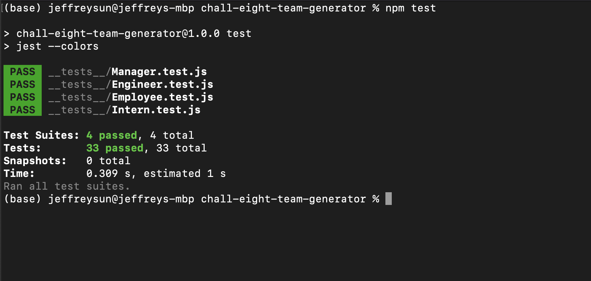
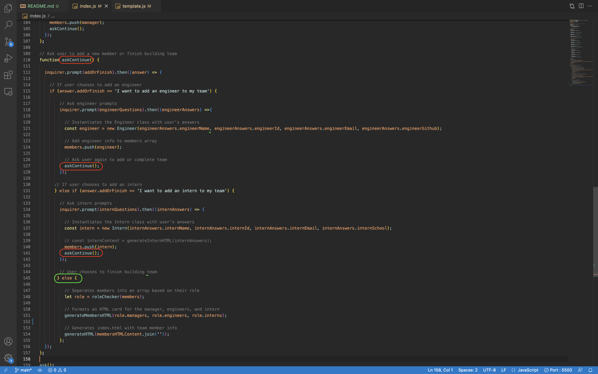

# Challenge Eight: Object Oriented Programming - Team Profile Generator

## Project Description

Challenge Eight required us to develop a Node.js command line application that generates and stylize an HTML webpage for the user after they enter information about their software engineering team. In this challenge, we utilized node, inquirer, and jest package. Inquirer was used to feed the user prompts and then format their answers into HTML. Jest was used to run tests on functionality of each of the classes and subclasses.

### Demo

The following video links to a demo of the Team Profile Generator

[Google Drive Demo Link](https://drive.google.com/file/d/1lum_2W3O4ZDjbKQe2hHGTOd_14SxJBGZ/view)

1. The directory is shown before the HTML page is generated.

2. The user runs the application with 'npm start' terminal.

3. User is first asked for the team manager's information. 

4. User is then asked if they would like to add another member or finish building their team.

5. User adds an engineer, an intern, and then another engineer before deciding to finish building their team.

6. An index.html page is generated in the 'dist' folder and is opened to display the newly generated team profile. 

7. User clicks on email of a member and the default email application starts writing an email to that address. 

8. User clicks on an engineer's GitHub username and is taken to their GitHub profile.

9. User then returns to their terminal and runs the applications tests with 'npm test'.

10. All tests for classes and subclasses pass and can be found in the '__tests__' folder.

### HTML Page

The following image shows the template to format the user's answer:

The following image shows the HTML page generated with the user's answers:

### Tests

The following image shows test output:

### Menu

To simulate a menu in the command line, the askContinue function calls on itself when the user wants to continue building their team. When the user chooses to finish building their team, they exit the function and continue. This was written to resolve the fact that inquirer runs asynchronously and it was difficult to wait for a user response. The code indicated in green shows the user exiting this function.

### Link to Github Repository
[https://github.com/jffsun/chall-eight-team-generator](https://github.com/jffsun/chall-eight-team-generator)